flutter 开发环境搭建

以下安装过程仅是winodws7系统下的安装过程。 windows其它系统的安装和win7下安装大致差不多。 如果是其它的如linux, 苹果的OSX系统。请参考flutter的官方文档来配置。

## 1. 安装Flutter

### 1.1 下载

下载 [flutter_windows_v1.9.1+hotfix.2-stable.zip](https://storage.googleapis.com/flutter_infra/releases/stable/windows/flutter_windows_v1.9.1+hotfix.2-stable.zip)

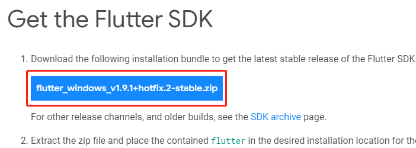

解压到你需要安装的盘。 如果我的： E:\soft\flutter

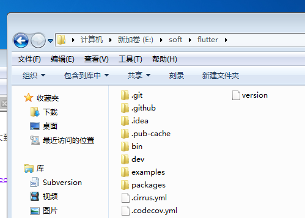


### 1.2 配置环境变量

回到桌面，右键计算机 -> 属性 -> 高级系统设置 -> 环境变量  打开环境变量设置界面

在用户变量里找到path, 把E:\soft\flutter\bin添加到path.

由于在国内访问Flutter有时可能会受到限制，Flutter官方为中国开发者搭建了临时镜像。 再在用户变量添加下面两个变量

PUB_HOSTED_URL = https://pub.flutter-io.cn

FLUTTER_STORAGE_BASE_URL = https://storage.flutter-io.cn

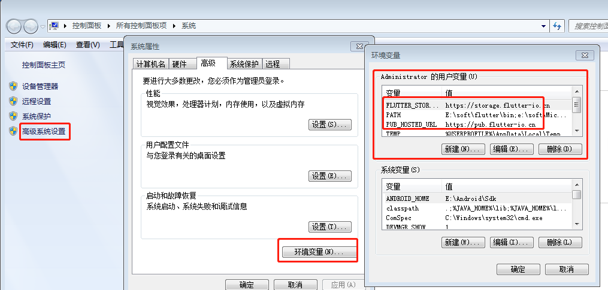

### 1.3 检查是否安装成功

打开cmd, 运行 **flutter**, 

```bash
flutter
```

能看到像下面这样的内容就说明flutter安装成功了。

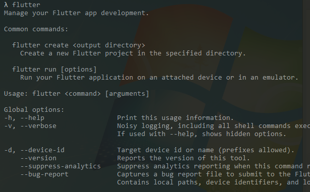


## 2. jdk安装

下载jdk安装，

打开计算机环境变量。 添加 如下变量：

JAVA_HOME=jdk安装目录

classpath=.;%JAVA_HOME%\lib;%JAVA_HOME%\lib\tools.jar;

在path变量中增加 %JAVA_HOME%\bin;


## 3. 安装Android studio和android 环境

### 3.1 下载android studio

打开android官网下载 [android studio](https://developer.android.google.cn/studio), 

如果打不开也可以到 [http://www.android-studio.org](http://www.android-studio.org/)网站下载

点击运行安装android studio. 

例如我的:
 Android studio安装目录： E:\Android\Android Studio
 Android SDK目录: E:\Android\Sdk


### 3.2 安装Android sdk

安装完成第一次运行时， android studio 会提示你要安装一些sdk, 直接点下一步安装就好。

注意： 这一步需要花费比较长的时间等待， 完成之后，Android Studio 默认的会为你安装好一个android版本的sdk, 并创建好一个相应的的模拟器。

添加环境变量ANDROID_HOME，把你android SDK的路径填上。 

在path中添加 %ANDROID_HOME%\platform-tools;%ANDROID_HOME%\tools;

重新打开cmd。

如果想安装更多版本的sdk，可以在菜单栏的tools -> SDK Manage进去管理sdk

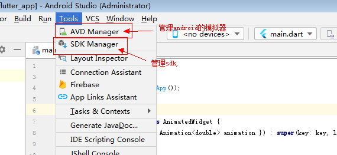


至此，我们的开发环境基本上就安装好了。下面来运行一下 flutter doctor 检查下当前的环境是否可以。

```bash
# 运行 flutter doctor 出在如下面的提示，说明我们的flutter 开发环境已经安装好了。

λ flutter doctor
Doctor summary (to see all details, run flutter doctor -v):
[√] Flutter (Channel stable, v1.9.1+hotfix.2, on Microsoft Windows [Version 6.1.7601], locale zh-CN)
[√] Android toolchain - develop for Android devices (Android SDK version 29.0.2)
[√] Android Studio (version 3.5)
[!] Connected device
    ! No devices available

! Doctor found issues in 1 category.
```


### 错误处理

1. #### 未在环境变量中配置ANDRIOD_HOME错误,  运行 **flutter doctor**,  出现如下错误：

   ```bash
   Doctor summary (to see all details, run flutter doctor -v):
   [√] Flutter (Channel stable, v1.9.1+hotfix.2, on Microsoft Windows [Version 6.1.7601], locale zh-CN)
   [X] Android toolchain - develop for Android devices
       X Unable to locate Android SDK.
         Install Android Studio from: https://developer.android.com/studio/index.html
         On first launch it will assist you in installing the Android SDK components.
         (or visit https://flutter.dev/setup/#android-setup for detailed instructions).
         If the Android SDK has been installed to a custom location, set ANDROID_HOME to that location.
         You may also want to add it to your PATH environment variable.
   
   [√] Android Studio (version 3.5)
   [!] Connected device
       ! No devices available
   
   ! Doctor found issues in 2 categories.
   ```

**解决方法：**

> 在环境变量中配置变量 ANDRIOD_HOME = 你的android SDK目录。


2. #### 提示 flutter doctor --android-licenses

    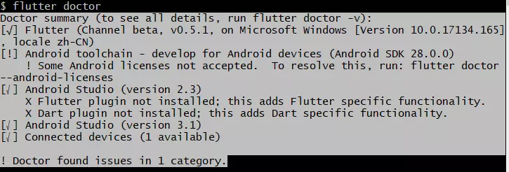

**解决方法：**

> 输入 flutter doctor --android-licenses，接下来所有的输入  y 就可以了

3. #### No devices available

> 这个错误比较好解决， 运行我们的android模拟器即可。


## 4. 插件安装

### 4.1 Android studio

> 打开File -> settings -> plugins, 搜索Flutter 安装

### 4.2 vscode

> 打开插件标签搜索flutter 安装


## 5. 创建，并运行一个flutter程序

### 5.1 android studio

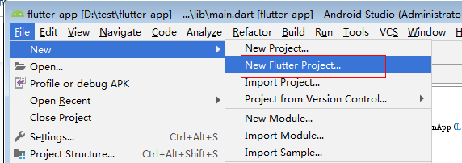

### 5.2 vscode

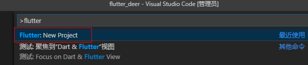

### 5.3 命令行

运行flutter create flutter_demo

```

flutter create flutter_demo

```

完成后显示如下图，表示创建成功

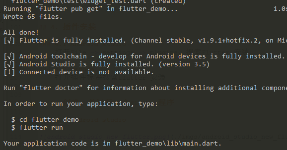


### 5.4 运行我们的第一个flutter程序 

我以vscode来讲。 先把模拟器运行起来。

点击右下角的No Device, 选择需要运行的模拟器点击运行。 我这里就只有一个模拟器。如下图

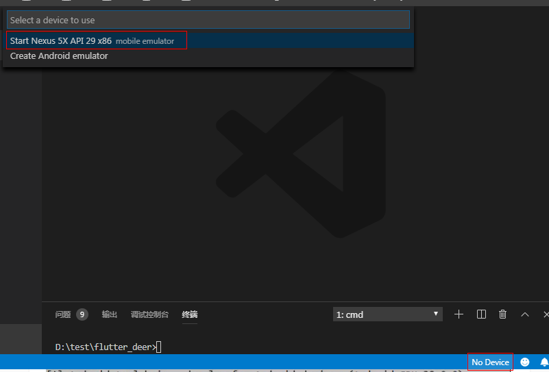

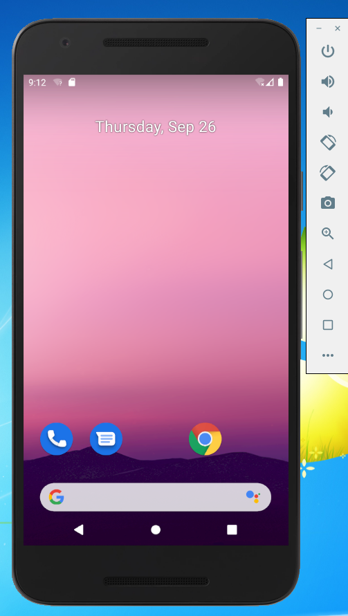


再运行flutter 程序

```bash
cd flutter_demo
flutter run  
```

app 运行起来如下图

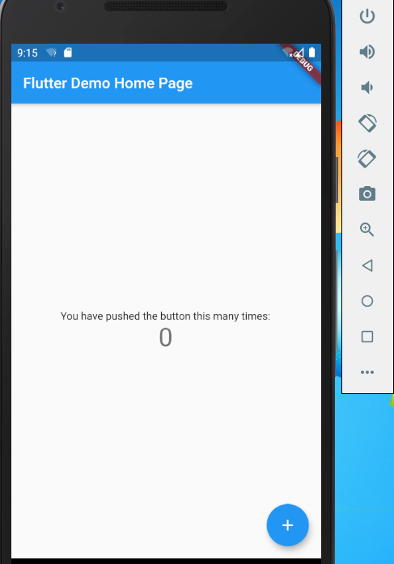


### Error runing Gradle 错误解决

运行时如果遇到了 **Error runing Gradle** 错误提示，这是因为墙的原因导致，解决方案是改为阿里的链接。

阿里链接:

 ```java
 maven { url 'https://maven.aliyun.com/repository/google' }
 maven { url 'https://maven.aliyun.com/repository/jcenter' }
 maven { url 'http://maven.aliyun.com/nexus/content/groups/public'}
        
 ```


需要修改的文件:

- 在项目目录下的android目录下的build.gradle文件。

- 修改Flutter SDK包下的flutter.gradle文件， 具体的文件路径是：

```
Flutter SDK目录\packages\flutter_tools\gradle\flutter.gradle

```

把文件里的google() 和 jcenter()这两行改为阿里的链接.


附录：

- [flutter官网](https://flutter.dev/)

- [flutter中文](https://flutter.cn/)

- [flutter第三方插件库](https://pub.dev/flutter)

- [flutter中文网](https://flutterchina.club/)

- [书籍： flutter实战](https://book.flutterchina.club/)