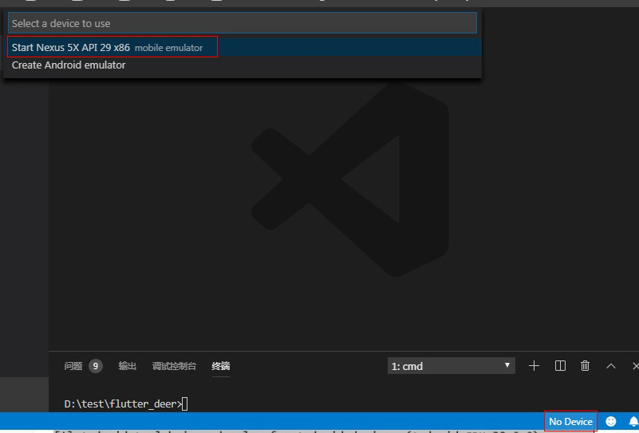

# flutter 开发环境搭建

以下安装过程仅是winodws7系统下的安装过程。 windows其它系统的安装和win7下安装大致差不多。 如果是其它的如linux, 苹果的OSX系统。请参考flutter的官方文档来配置。

## 1. 安装Flutter

### 1.1 下载

下载 [flutter_windows_v1.9.1+hotfix.2-stable.zip](https://storage.googleapis.com/flutter_infra/releases/stable/windows/flutter_windows_v1.9.1+hotfix.2-stable.zip)


解压到你需要安装的盘。 如果我的： E:\soft\flutter


### 1.2 配置环境变量

回到桌面，右键计算机 -> 属性 -> 高级系统设置 -> 环境变量  打开环境变量设置界面

在用户变量里找到path, 把E:\soft\flutter\bin添加到path.

由于在国内访问Flutter有时可能会受到限制，Flutter官方为中国开发者搭建了临时镜像。 再在用户变量添加下面两个变量

PUB_HOSTED_URL = https://pub.flutter-io.cn

FLUTTER_STORAGE_BASE_URL = https://storage.flutter-io.cn


### 1.3 检查是否安装成功

打开cmd, 运行 **flutter**, 

```bash
flutter
```

能看到像下面这样的内容就说明flutter安装成功了。


## 2. jdk安装


## 3. 安装Android studio和android 环境

### 3.1 下载android studio

打开android官网下载 [android studio](https://developer.android.google.cn/studio), 

如果打不开也可以到 [http://www.android-studio.org](http://www.android-studio.org/)网站下载

点击运行安装android studio. 

例如我的:
 Android studio安装目录： E:\Android\Android Studio
 Android SDK目录: E:\Android\Sdk
 
 
### 3.2 安装Android sdk

安装完成第一次运行时， android studio 会提示你要安装一些sdk, 直接点下一步安装就好。。 注意： 这一步需要花费比较长的时间等待， 完成之后，
Android Studio 默认的会为你安装好一个android版本的sdk, 并创建好一个相应的的模拟器。

添加环境变量ANDROID_HOME，把你android SDK的路径填上。 重新打开cmd。

如果想安装更多版本的sdk，可以在菜单栏的tools -> SDK Manage进去管理sdk


至此，我们的开发环境基本上就安装好了。下面来运行一下 flutter doctor 检查下当前的环境是否可以。

```
flutter doctor

```

如果出现如下错误：

1. 如果提示了  Unable to locate Android SDK.

	解决方法：

	添加环境变量ANDROID_HOME，把你android SDK的路径填上，重启电脑即可。

2. 


	解决方法：

	输入 flutter doctor --android-licenses，接下来所有的输入  y 就可以了
	
	

## 4. 插件安装

### 4.1 Android studio
	打开File -> settings -> plugins, 搜索Flutter 安装
	
### 4.2 vscode
	打开插件标签搜索flutter 安装


## 5. 创建，并运行一个flutter程序

### 5.1 android studio


### 5.2 vscode


### 5.3 命令行

运行flutter create flutter_demo

```

flutter create flutter_demo

```

完成后显示如下图，表示创建成功


### 5.4 运行我们的第一个flutter程序 

我以vscode来讲。 先把模拟器运行起来。

点击右下角的No Device, 选择需要运行的模拟器点击运行。 我这里就只有一个模拟器。如下图




再运行flutter 程序

```

cd flutter_demo

flutter run
  
```

app 运行起来如下图


### Error runing Gradle 错误解决

在Debug项目的时候，如果出现类似下面这样的错误，这就应该是中国特有的墙的问题， 解决方案是改为阿里的链接。

```bash
Launching lib/main.dart on Android SDK built for x86 in debug mode...
Initializing gradle...
Resolving dependencies...
* Error running Gradle:
ProcessException: Process "/Users/rabbit/develop/android/flutter_app/android/gradlew" exited abnormally:
Project evaluation failed including an error in afterEvaluate {}. Run with --stacktrace for details of the afterEvaluate {} error.

FAILURE: Build failed with an exception.

* Where:
Build file '/Users/rabbit/develop/android/flutter_app/android/app/build.gradle' line: 25

* What went wrong:
A problem occurred evaluating project ':app'.
> Could not resolve all files for configuration 'classpath'.
   > Could not find lint-gradle-api.jar (com.android.tools.lint:lint-gradle-api:26.1.2).
     Searched in the following locations:
         https://jcenter.bintray.com/com/android/tools/lint/lint-gradle-api/26.1.2/lint-gradle-api-26.1.2.jar

* Try:
Run with --stacktrace option to get the stack trace. Run with --info or --debug option to get more log output. Run with --scan to get full insights.

* Get more help at https://help.gradle.org

BUILD FAILED in 0s
  Command: /Users/rabbit/develop/android/flutter_app/android/gradlew app:properties

Finished with error: Please review your Gradle project setup in the android/ folder.
```

```
maven { url 'https://maven.aliyun.com/repository/google' }
maven { url 'https://maven.aliyun.com/repository/jcenter' }
maven { url 'http://maven.aliyun.com/nexus/content/groups/public' }

```

第一步：修改掉项目下的android目录下的build.gradle文件，把google() 和 jcenter()这两行注释掉。改为阿里的链接。

```
buildscript {
    repositories {
        //  google()
        //  jcenter()
        maven { url 'https://maven.aliyun.com/repository/google' }
        maven { url 'https://maven.aliyun.com/repository/jcenter' }
        maven { url 'http://maven.aliyun.com/nexus/content/groups/public'}
        }
        dependencies {
        classpath 'com.android.tools.build:gradle:3.1.2'
    }
}

allprojects {
    repositories {
        // google()
        // jcenter()
        maven { url 'https://maven.aliyun.com/repository/google' }
        maven { url 'https://maven.aliyun.com/repository/jcenter' }
        maven { url 'http://maven.aliyun.com/nexus/content/groups/public' }
    }
}

rootProject.buildDir = '../build'
subprojects {
    project.buildDir = "${rootProject.buildDir}/${project.name}"
}
subprojects {
    project.evaluationDependsOn(':app')
}

task clean(type: Delete) {
    delete rootProject.buildDir
}

```

第二步：修改Flutter SDK包下的flutter.gradle文件,这个目录要根据你的SDK存放的位置有所变化

如我的路径就是：

```
E:\soft\flutter\packages\flutter_tools\gradle
```

打开flutter.gradle文件进行修改，把google() 和 jcenter()这两行注释掉。改为阿里的链接

```
buildscript {
    repositories {
        //jcenter()
        // maven {
        //     url 'https://dl.google.com/dl/android/maven2'
        // }
        maven{
            url 'https://maven.aliyun.com/repository/jcenter'
        }
        maven{
            url 'http://maven.aliyun.com/nexus/content/groups/public'
        }
    }
    dependencies {
        classpath 'com.android.tools.build:gradle:3.1.2'
    }
}
```


附录：

- [flutter官网](https://flutter.dev/)

- [flutter中文](https://flutter.cn/)

- [flutter第三方插件库](https://pub.dev/flutter)

- [flutter中文网](https://flutterchina.club/)

- [书籍： flutter实战](https://book.flutterchina.club/)